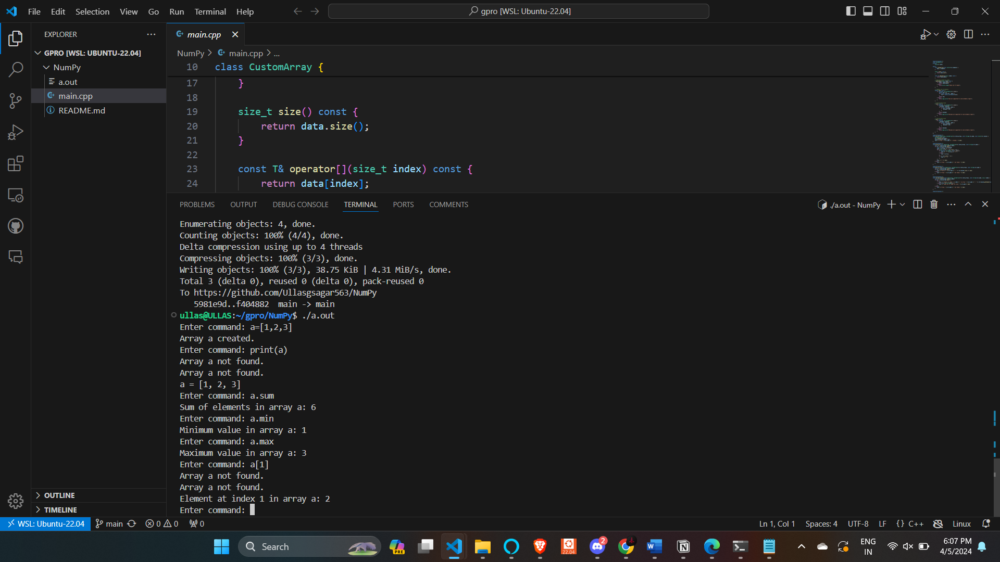

# NumPy
implimentig some of numpy array methods using c++ and templet
this project show how genric progaramming can be usefull

# run and test
ullas@ULLAS:~/CC_E4_PES1UG22CS844/gpro/NumPy$ g++ main.cpp -std=c++17 
ullas@ULLAS:~/CC_E4_PES1UG22CS844/gpro/NumPy$ ./a.out 
Enter command: a=[1,2,3] 
Array a created. 
Enter command: print(a) 
a = [1, 2, 3] 
Enter command: b=[1.1,1.2]            
Array b created. 
Enter command: print(b) 
b = [1.1, 1.2] 
Enter command: c=["1","q"] 
Array c created. 
Enter command: print(c) 
c = ["1", "q"] 
Enter command: d=["ab] 
Array d created. 
Enter command: print(d) 
d = ["ab] 
Enter command: a.size 
Size of a: 3 
Enter command: a.max 
Maximum value in array a: 3 
Enter command: a.sum 
Sum of elements in array a: 6 
Enter command: a.min 
Minimum value in array a: 1 
Enter command: a[1] 
Element at index 1 in array a: 2 
Enter command: a[2] 
Element at index 2 in array a: 3 
Enter command:  

