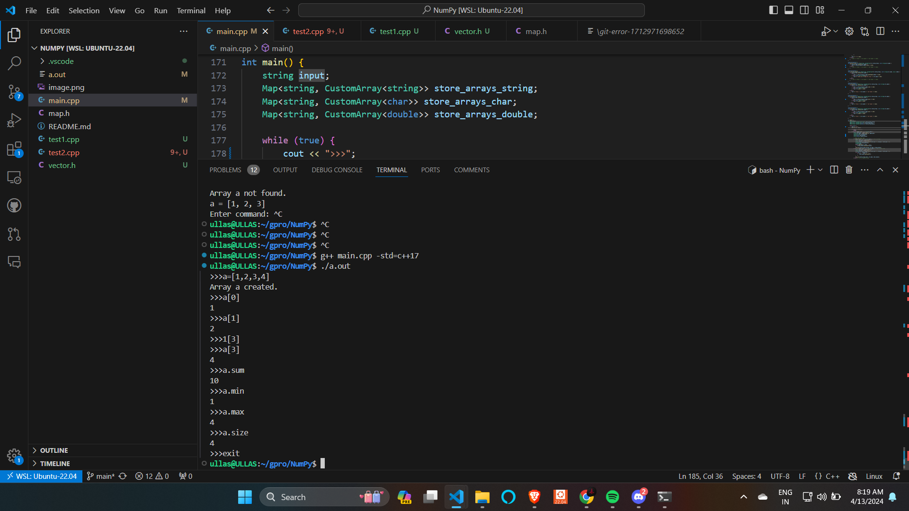

# NumPy Array Methods Implementation in C++ with Templates

This project demonstrates how generic programming can be useful by implementing some of NumPy's array methods using C++ and templates. It highlights the versatility and reusability of code when working with different data types.

## Running and Testing

To compile and run the program:

```bash
g++ main.cpp -std=c++17
./a.out
```


#phase 2


